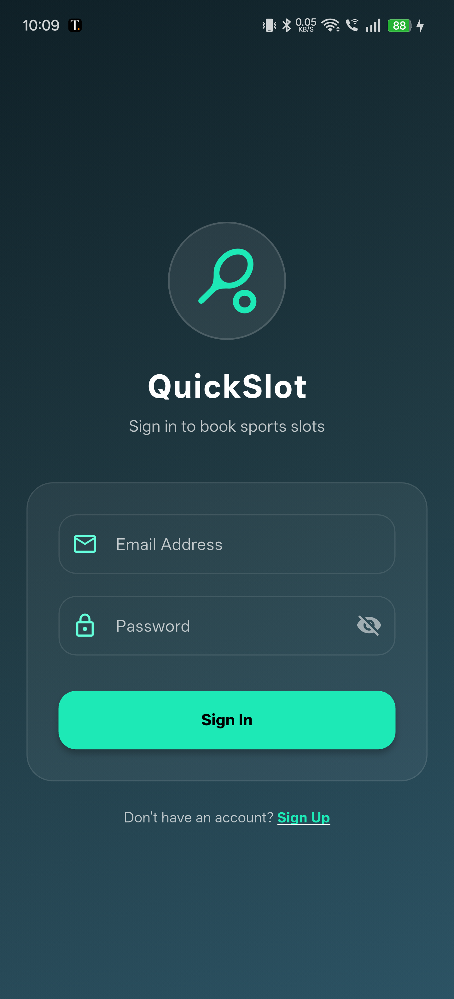
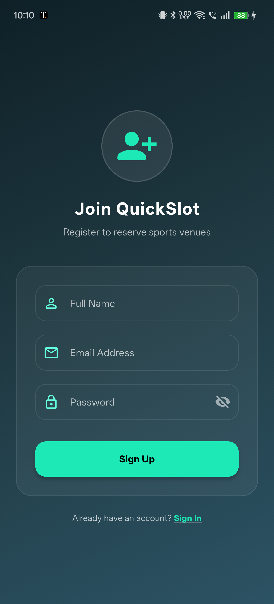
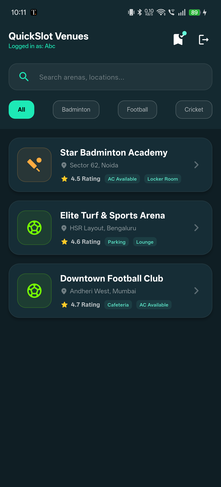
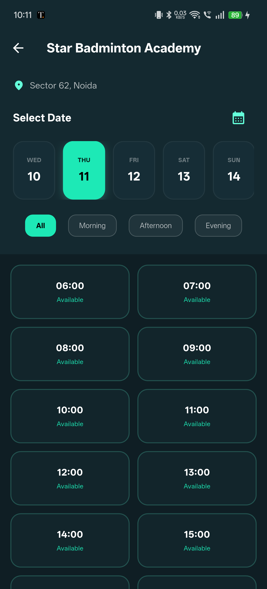
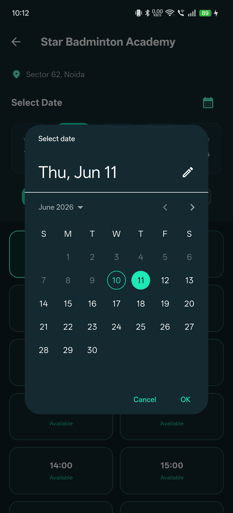
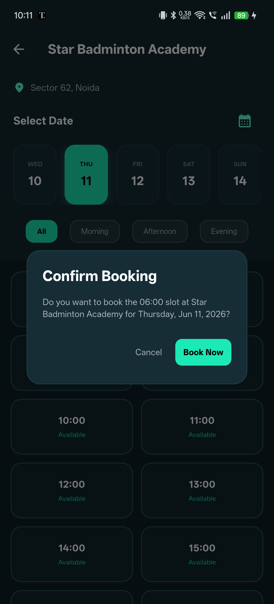
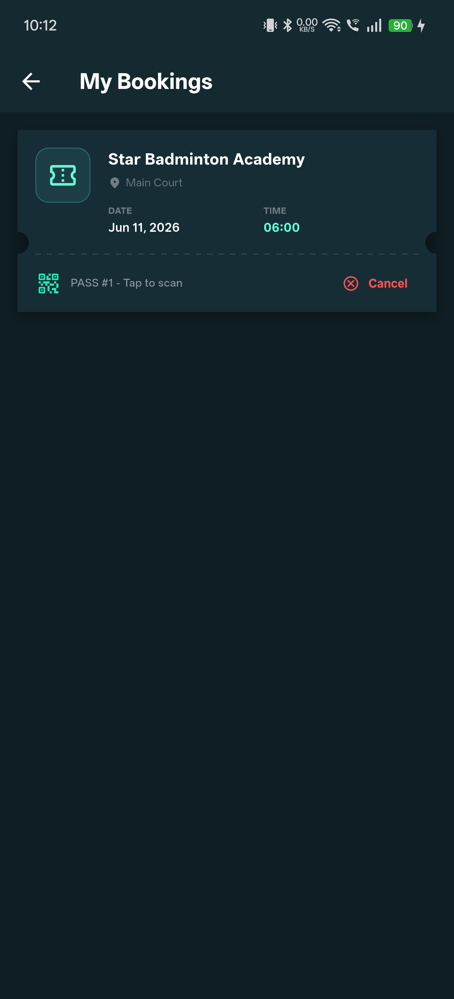
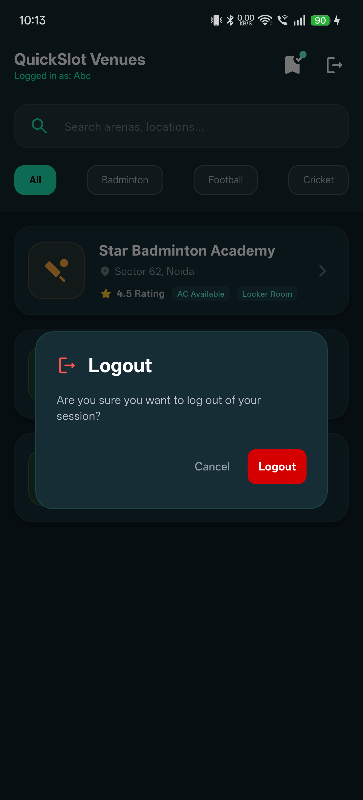

# QuickSlot App 📲

A premium-grade Flutter mobile application for booking sports venue slots, styled with a custom Material 3 Dark theme (Slate/Teal) and managed using the BLoC pattern.

---

## 🚀 Download & Live API
* 🤖 [Download Android APK](https://github.com/Akash-ptl/quickslot_app/releases)
* 🌐 [Production API Swagger Docs](https://quickslot-backend-jdhl.onrender.com/docs)

## 📸 App Screenshots

<table border="1" cellpadding="5">
  <tr>
    <td align="center" width="33%"><b>Login Screen</b></td>
    <td align="center" width="33%"><b>Sign Up Screen</b></td>
    <td align="center" width="33%"><b>Venue Dashboard</b></td>
  </tr>
  <tr>
    <td></td>
    <td></td>
    <td></td>
  </tr>
  <tr>
    <td align="center"><b>Venue Details & Slots</b></td>
    <td align="center"><b>Date Picker Dialog</b></td>
    <td align="center"><b>Confirm Booking Dialog</b></td>
  </tr>
  <tr>
    <td></td>
    <td></td>
    <td></td>
  </tr>
  <tr>
    <td align="center" colspan="2"><b>My Bookings (Tickets Layout)</b></td>
    <td align="center"><b>Logout Dialog</b></td>
  </tr>
  <tr>
    <td colspan="2" align="center"></td>
    <td></td>
  </tr>
</table>

---

## 📐 Architecture Note & Folder Layout
The app is built using a layer-first structure inside the `lib/` directory:
* `data/`: REST client ([api_service.dart](lib/data/api_service.dart)) and data schemas ([models.dart](lib/data/models.dart)).
* `bloc/`: BLoC managers for decoupled state management (`auth`, `venue`, `slot`, `booking`).
* `screens/`: Layout screens ([initial_screen.dart](lib/screens/initial_screen.dart), [login_screen.dart](lib/screens/login_screen.dart), [register_screen.dart](lib/screens/register_screen.dart), [venue_list_screen.dart](lib/screens/venue_list_screen.dart), [venue_details_screen.dart](lib/screens/venue_details_screen.dart), [my_bookings_screen.dart](lib/screens/my_bookings_screen.dart)).
* `widgets/`: Premium notification alert helper ([premium_snackbar.dart](lib/widgets/premium_snackbar.dart)) and custom shimmer skeleton overlays ([shimmer_loading.dart](lib/widgets/shimmer_loading.dart)).

---

## 🔄 App User Flow

```text
  [LoginScreen] ────► [VenueListScreen] ────► [VenueDetailsScreen] ◄────► [MyBookingsScreen]
  (Auto-Login Check)   (Shimmer Loaders)      (Timeline Picker)           (Stadium Passes Layout)
```

1. **Auto-Login / Splash Screen**: App starts at `InitialScreen`, checks if session token exists in local storage (`shared_preferences`), and dynamically routes to `VenueListScreen` or `LoginScreen`.
2. **Venue Listing Feed**: Displays active sports grounds with search capability, categorization chips, shimmer placeholders, and cascading entry animations.
3. **Availability Grid & Booking**: Displays dates in a scrollable timeline capsule list and slots as a status grid. Tapping a slot opens a booking confirmation modal.
4. **My Bookings Manager**: Displays active bookings styled as stadium ticket passes. Users can view passes or cancel a booking.

---

## ⚡ Concurrency Conflict UX Flow

Double-booking collisions are handled cleanly using BLoC's state-listener flow:

```text
  [Slot Grid] ──(Tap Book)──► [SlotBloc] ──(POST /bookings)──► [FastAPI Backend]
                                                                        │
  [Grid Refreshed] ◄──(Reset)─── [SlotBloc] ◄──(Conflict State)◄─── [409 Conflict]
          │
  [Collision Dialog shown]
```

1. If another user books the slot milliseconds earlier, the backend database composite unique constraint rejects the second write and yields a `409 Conflict`.
2. The `SlotBloc` intercepts the conflict, pulls updated slot states, and emits `bookingStatus: 'conflict'`.
3. The UI listener detects the status, dismisses the progress spinner, triggers a custom warning dialog, and refreshes the slot grid.

---

## 🛠️ Setup & Running Locally
1. Fetch packages:
   ```bash
   flutter pub get
   ```
2. Start the Flutter app:
   ```bash
   flutter run
   ```
*Note: The app is configured to connect to uvicorn running on your local computer's Wi-Fi network gateway (`192.168.0.100:8000`) for seamless debugging on physical devices.*

---

## 💡 Hackathon Deliverables & Defense Notes

### 1. Scope Decisions (What We Cut & Why)
* **Full Third-Party OAuth**: Cut in favor of custom JWT validation to spend our focus checking and tuning concurrent database booking transaction locks.
* **Live WebSocket Feeds**: Cut to avoid battery/network overhead, opting for clean haptics and client-side empty/error reload triggers instead.

### 2. If We Had One More Day...
* **WebSockets Gateway**: Implement live synchronization to auto-update slot grid cells in real-time when booked on another device.
* **Offline Caching**: Implement local SQLite read caching for ticket passes to support offline inspection of active bookings.

### 3. AI Usage & Correction Note
* **Used AI for**: Initial BLoC boilerplates, custom clipper notch curves, and shimmer loading layouts.
* **AI Correction**: The AI suggested generic loopback routing hosts (`127.0.0.1` and `10.0.2.2`) which blocked physical testing devices from reaching the backend server. We resolved this by binding uvicorn to `0.0.0.0` and mapping the mobile client to the laptop's Wi-Fi network gateway IP (`192.168.0.100`), establishing successful cross-device connection.
